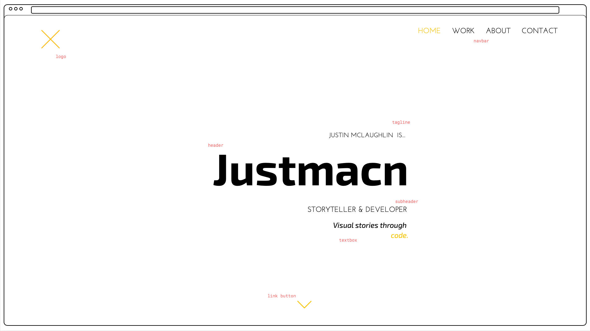
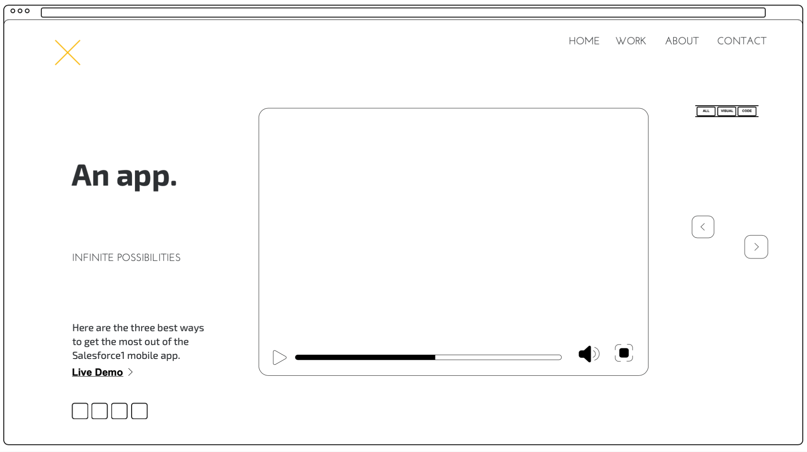
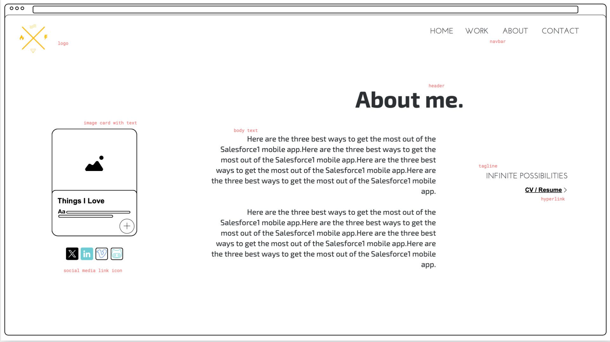
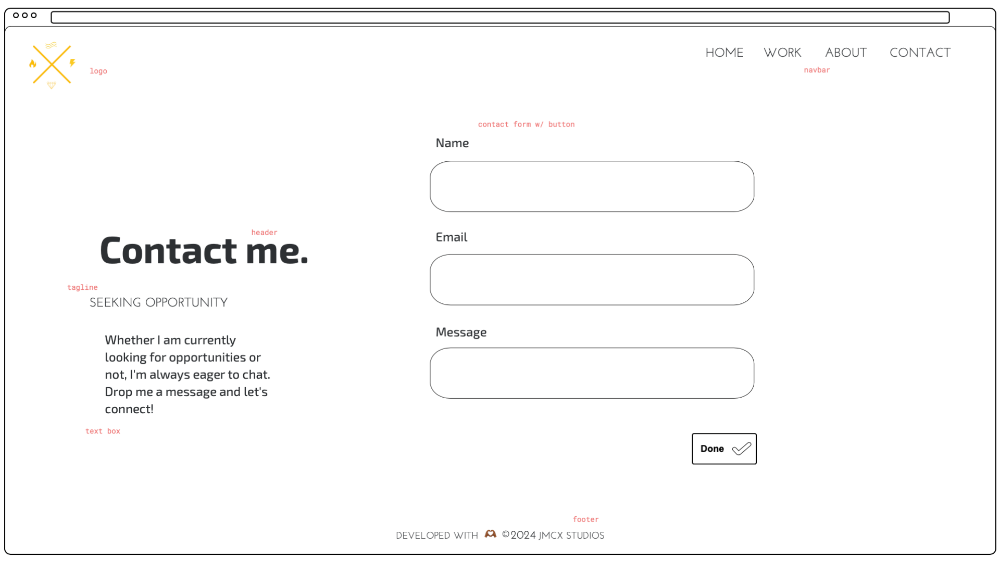
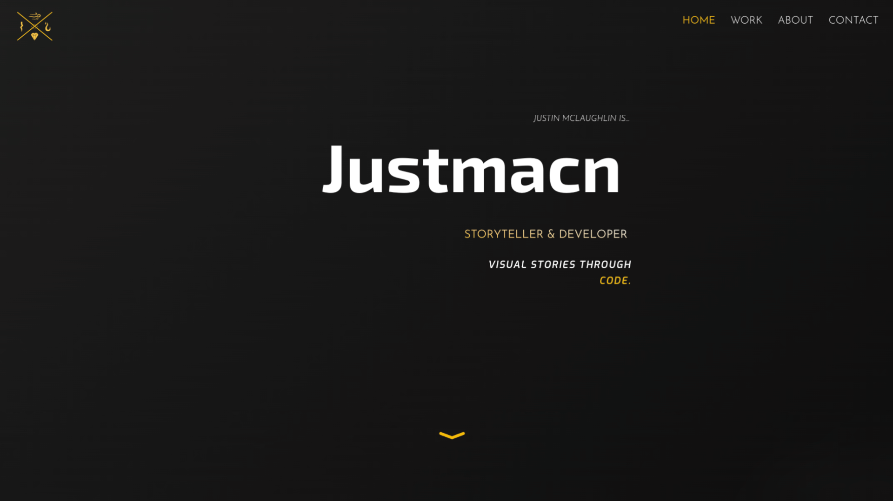
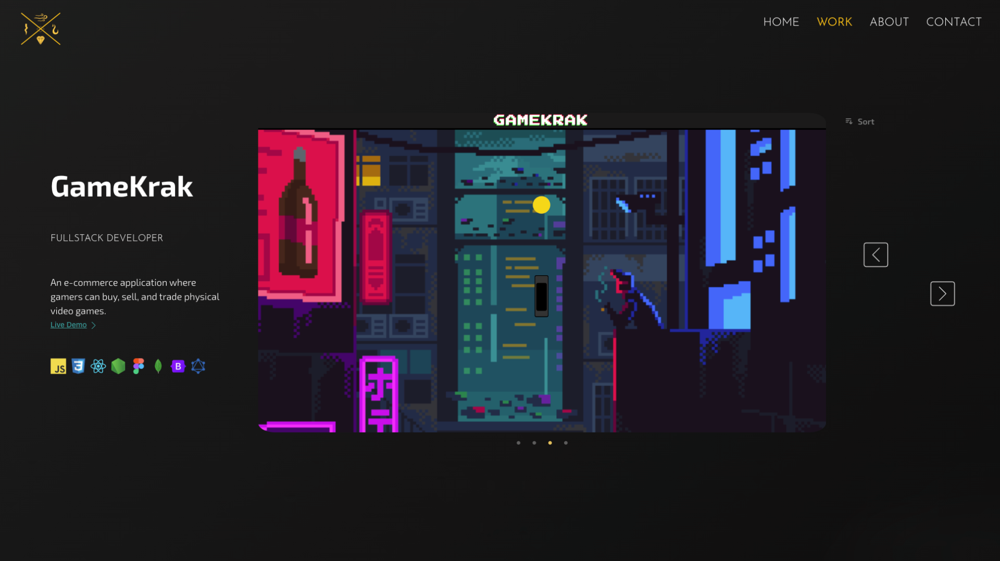

# React Portfolio

[](https://reactjs.org/)
[](https://chakra-ui.com/)
[](https://developer.mozilla.org/en-US/docs/Web/JavaScript)
[](https://vitejs.dev/)
[](https://react-slick.neostack.com/)
[](https://git-scm.com/)
[](https://github.com/justmacn/React-Portfolio)

---

My professional portfolio site built with React.js and Chakra UI, showcasing my work and recent projects. 


## Goals

This portfolio was designed with a specific visual target in mind. I created detailed wireframes before development began and challenged myself to match them as closely as possible during implementation.

## Features

- Built with React and Chakra UI
- Carousel-based project viewer with video and image support
- Project sorting and filter using radio menu

### Wireframes

> Original layout references

| Homepage Wireframe | Work Page Wireframe |
|--------------------|---------------------|
|  |  |

| About Page Wireframe | Contact Page Wireframe |
|----------------------|------------------------|
|  |  |

### Final Designs

> Live examples from the project

| Homepage | Work Page |
|----------|-----------|
|  |  |


- [Live Demo](https://justmacn.netlify.app/)
(*currently in active development.*)

## Getting Started

Clone the repository and install dependencies:

```bash
git clone https://github.com/justmacn/React-Portfolio.git
cd React-Portfolio
npm install
npm run dev
```
## Technologies Used

- React
- Chakra UI
- JavaScript
- Vite
- Slick Carousel

## Status

This project is still under development. Certain pages and features may be incomplete.

## License

This project is open source and available under the [MIT License](https://chatgpt.com/c/LICENSE).